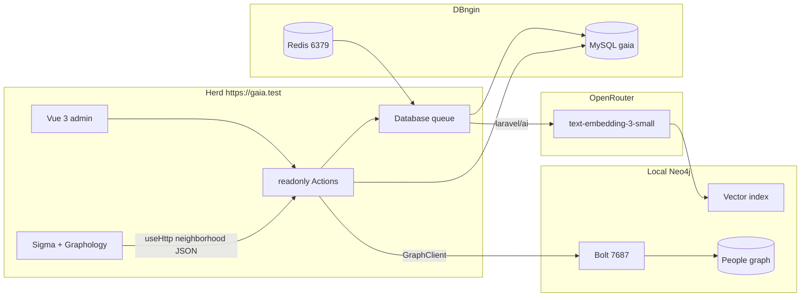

# Recommended Gaia stack

**Date:** 2026-09-12  
**Status:** Synthesis of the five primary-source notes. Not implemented yet.

This is the default we should build unless you want to swap the runner-up (FalkorDB) or add Herd Pro Postgres later.

## Decision

| Layer | Choice | Why |
| --- | --- | --- |
| App / auth / dump staging / jobs | DBngin MySQL `gaia` (already running) | Kit default after Herd link. Do not store the graph here. |
| Cache / queue Redis | DBngin Redis `:6379` (already running) | Leave it alone. Never load a graph module into this process. |
| Entity / relationship store | **Neo4j Community via Homebrew** | Afternoon macOS install, Cypher, disk + page cache, Community vector indexes, Neo4j-documented PHP client. |
| PHP graph access | `laudis/neo4j-php-client` 3.6 over Bolt (`bolt://127.0.0.1:7687`) | HTTP removed from that client in 3.3. Bind a `GraphClient` singleton — not an Eloquent connection. |
| Embeddings API | `laravel/ai` + OpenRouter, pin `openai/text-embedding-3-small` @ 1536 | Official Embeddings matrix includes OpenRouter. Always pass `Lab::OpenRouter`. |
| Vector index | **Neo4j Community vector index on Person** first | Avoids a third database. Laravel `whereVectorSimilarTo` needs pgvector; add DBngin/Herd Pro Postgres only if we want that API later. |
| Admin viewport | Sigma.js v3 + Graphology | WebGL for 200–2000 nodes. Fetch neighborhoods via Wayfinder + Inertia `useHttp`, never page props. |
| Schema | Fuzzy `Person` + hash-keyed `Identifier` / `Account` | STIX / OpenCTI / Maltego pattern. Embeddings only propose `SAME_AS`. |

**Runner-up graph store:** FalkorDB in Docker on **6380** (not 6379), official `falkordb-php`. Same Cypher-ish Actions, different adapter.

**Rejected for v1:** Kuzu (archived, no PHP), AGE-on-DBngin (undocumented compile), Memgraph as default (BSL + in-memory RAM), SurrealQL as the admin query language, MySQL JSON vectors, full-graph render.

## How the pieces fit

## Data shape (locked)

- **Nodes:** `Person` (mergeable, UUIDv4), `Identifier` (type + normalized value → UUIDv5), `Account`, `Organization`, `Location`, `Document` / dump, `Observation`.
- **Edges:** `HAS_IDENTIFIER`, `HAS_ACCOUNT`, `MEMBER_OF`, `MENTIONED_IN`, `APPEARS_IN_DUMP`, `LOCATED_AT`, proposed `SAME_AS` (never auto-merged from cosine).
- **Provenance on every assertion:** `dumpId`, `rowId`, `source`, `observedAt`, `ingestedAt`, `confidence`, parser version.
- **Do not** `MERGE` on first name or walk identity through `gmail.com`.

Details: [03-osint-people-graph.md](./03-osint-people-graph.md).

## Laravel kit mapping

Actions stay `final readonly` with `handle()`:

1. `IngestDump` — store file + metadata in MySQL, dispatch chunks.
2. `ParseDumpChunk` — CSV/JSON/NDJSON rows → upsert jobs.
3. `UpsertPerson` / `LinkIdentifier` — deterministic `MERGE` via `GraphClient`.
4. `ExpandNeighborhood` — 1–3 hops, hard limits (≤1000 nodes / 100 new neighbours).
5. `SearchEntities` — identifier lookup first; optional vector kNN later.
6. `EmbedPersonSummary` — OpenRouter, cache + `content_sha256`, write 1536-d list onto the Person.

Jobs wrap those Actions. Spatie Data: `GraphNode`, `GraphEdge`, `Neighborhood`. Controllers stay thin. PHPUnit stays sqlite; mock `GraphClient`; gate live Bolt behind `GRAPH_INTEGRATION`.

## First build slice (when you say go)

1. `brew install neo4j && brew services start neo4j` — Browser `http://localhost:7474`, change `neo4j/neo4j`, Bolt `7687`.
2. `composer require laudis/neo4j-php-client` — `GRAPH_DRIVER=neo4j`, `GRAPH_URI=bolt://127.0.0.1:7687`, constraints for Identifier uniqueness.
3. MySQL tables for dumps, chunks, parse errors.
4. CSV ingest of a tiny fixture (two people, shared email) proving `MERGE` + provenance.
5. Dashboard explorer: search → `ExpandNeighborhood` → Sigma canvas + shadcn inspector Sheet.
6. Only then `composer require laravel/ai`, `OPENROUTER_API_KEY`, embed summaries. Leave OpenRouter I/O logging **off**; send `data_collection: deny`.

## Local ports (do not collide)

| Service | Port |
| --- | --- |
| Herd site | `https://gaia.test` |
| DBngin MySQL | 3306 |
| DBngin Redis | 6379 |
| Neo4j Browser | 7474 |
| Neo4j Bolt | 7687 |
| FalkorDB if we ever add it | 6380 + Browser 3000 |

## Sources

- [01-local-graph-databases.md](./01-local-graph-databases.md)
- [02-laravel-ai-openrouter.md](./02-laravel-ai-openrouter.md)
- [03-osint-people-graph.md](./03-osint-people-graph.md)
- [04-vue-graph-visualization.md](./04-vue-graph-visualization.md)
- [05-laravel-graph-architecture.md](./05-laravel-graph-architecture.md)
