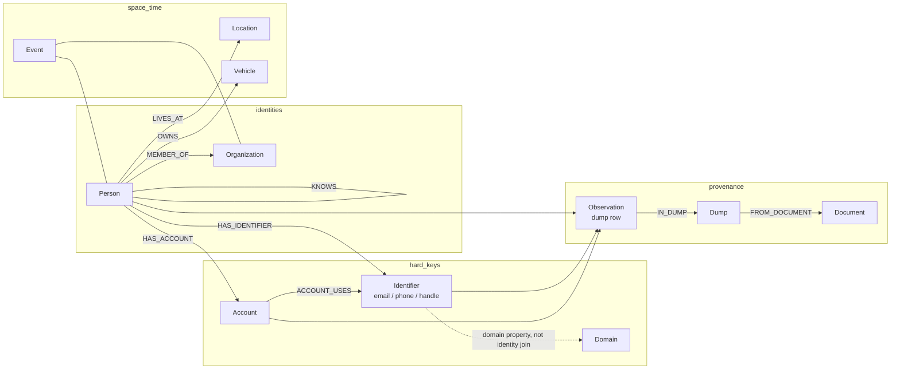
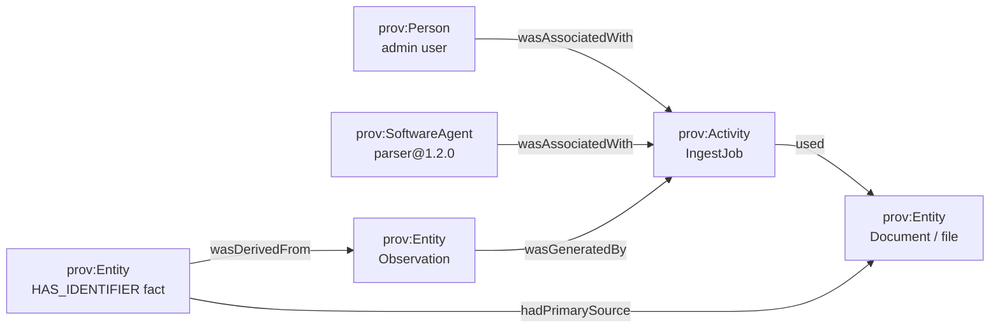
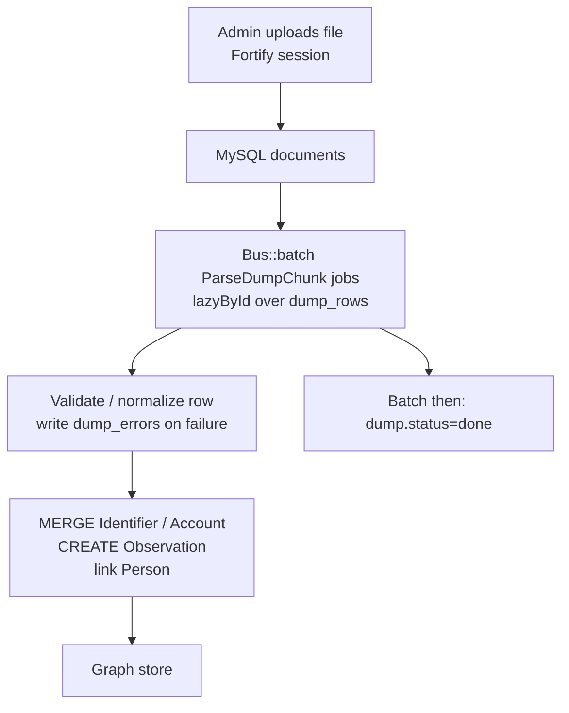

# OSINT people graph: property-graph schema, ingest, queries, privacy

**Date:** 2026-09-12  
**Project:** Gaia — ingest operator-supplied public dumps of people and surrounding metadata into a node/edge store, then browse from a Laravel admin.  
**Scope:** modeling, provenance, entity resolution, ingest architecture, neighborhood queries, dump formats, and privacy.  
**Out of scope:** collecting illicit data, scraping authenticated sites, bypassing access controls, credential stuffing, or obtaining leaked databases. This note assumes the operator already holds CSV / JSON / NDJSON (and later GEXF / GraphML) files they are legally allowed to process.

Every factual claim below is tied to the document that owns it.

---

## Verdict

Treat **people as fuzzy, mergeable identities** and **emails / phones / handles as hard, hash-keyed identifiers**. That split is what STIX 2.1, OpenCTI, Maltego, MISP, and FollowTheMoney all do, independently.

Do **not** write dump rows straight into the graph. Stage files, row batches, and parse errors in DBngin MySQL; parse in Laravel database-queue jobs; `MERGE` into the graph only after a deterministic ID exists. OpenCTI’s workbench / worker split and Neo4j’s “constraints first, then `LOAD CSV` + `MERGE`” are the two official patterns to copy.

Do **not** render the full graph. Neo4j Browser itself caps visualization at 1,000 nodes and 100 new neighbours and warns that raising those limits degrades performance. The admin must paginate ego neighbourhoods (1–3 hops, hard `LIMIT`) and compute paths with Cypher / GQL shortest-path primitives.

**Deterministic entity resolution first** (type + normalized value → UUIDv5-style ID). Embeddings / GDS kNN later, as a *proposal* of `SAME_AS`, never as an automatic merge.

---

## 1. Standards baseline (what a property graph *is*)

ISO/IEC 39075:2024 (GQL) is the first ISO database language for property graphs. A GQL graph stores **nodes (vertices) and edges (relationships)**; both may carry **labels** and **properties**. Graphs may be schema-free or constrained by a **graph type** inside a GQL-schema; the catalog is accessed through authenticated sessions and transactional units of work. GQL pattern matching supports quantified hops such as `((a)-[r]->(b)){1,5}`. ([ISO/IEC JTC 1 article on ISO/IEC 39075](https://jtc1info.org/wp-content/uploads/2024/04/2024-Article-39075-Database-Language-GQL.docx.pdf); [IEC publication record](https://webstore.iec.ch/en/publication/94107))

W3C does **not** publish a property-graph Recommendation. The 2019 W3C Workshop on Graph Data recorded that property-graph query work belongs with ISO (GQL and SQL/PGQ), while W3C’s standardized graph stack remains RDF / SPARQL; the workshop asked for interoperability, not a competing PG model. ([W3C workshop report](https://www.w3.org/Data/events/data-ws-2019/report.html))

W3C **does** own provenance: PROV-O (Recommendation, 30 April 2013) defines `prov:Entity`, `prov:Activity`, `prov:Agent`, plus `prov:wasGeneratedBy`, `prov:wasDerivedFrom`, `prov:wasAttributedTo`, `prov:used`, `prov:hadPrimarySource`, `prov:alternateOf`, `prov:generatedAtTime`. ([W3C PROV-O](https://www.w3.org/TR/prov-o/))

Neo4j’s property-graph model (the implementation Gaia is most likely to speak Cypher against):

- **Nodes** are discrete entities; they may have zero or more **labels**.
- **Relationships** always have **one type**, **one direction**, and connect a source to a target.
- Both nodes and relationships hold **properties** (key-value pairs; values may be scalars or homogeneous lists).
- Neo4j is schema-optional: indexes and constraints are introduced when wanted.
- Recommended names: labels `PascalCase`, relationship types `SCREAMING_SNAKE`, properties `camelCase`.

([Neo4j graph database concepts](https://neo4j.com/docs/getting-started/appendix/graphdb-concepts/))

Kuzu requires a declared schema: `CREATE NODE TABLE … PRIMARY KEY` (the table name *is* the label) and `CREATE REL TABLE … FROM … TO …`. ([Kuzu create-table docs, via kuzudb/docs](https://github.com/kuzudb/docs/blob/main/src/content/docs/cypher/data-definition/create-table.md))

Apache AGE is labelled Cypher over PostgreSQL: create the graph and labels first, then load vertices, then edges; `MERGE` matches or creates a whole pattern and will not partially reuse existing pieces. ([AGE load-from-file](https://age.apache.org/age-manual/master/intro/agload.html); [AGE MERGE](https://age.apache.org/age-manual/master/clauses/merge.html))

---

## 2. What OSINT / intel platforms actually model (patterns only)

Gaia is not a CTI platform, but the **entity split** those products publish is the closest primary-source vocabulary for “people plus identifiers plus sources.”

### 2.1 STIX 2.1 (OASIS)

STIX 2.1 is JSON. Domain objects (SDOs) include **Identity**, **Location**, **Observed Data**, **Report**, **Note**. Cyber-observable objects (SCOs) include **email-addr**, **domain-name**, **user-account**. Relationship objects (SROs) are **Relationship** and **Sighting**. Common relationship names include `related-to`, `duplicate-of`, `derived-from`, `located-at`. Confidence, when present, is an integer **0–100**. ([OASIS STIX intro](https://oasis-open.github.io/cti-documentation/stix/intro.html); [STIX 2.1 OS](https://docs.oasis-open.org/cti/stix/v2.1/os/stix-v2.1-os.html))

**Identity** represents “actual individuals, organizations, or groups” *or* classes of them. Specific properties: `name`, `description`, `roles`, `identity_class` (individual vs organization), `sectors`, `contact_information`. `contact_information` is explicitly **unstructured** — “No format for this information is currently defined.” The defined Identity→Location relationship is `located-at`. Common relationships: `duplicate-of`, `derived-from`, `related-to`. ([STIX 2.1 §4.5](https://docs.oasis-open.org/cti/stix/v2.1/os/stix-v2.1-os.html))

So: **do not store emails/phones as blobs on Person**. STIX itself refuses to give `contact_information` a schema and instead defines separate SCOs.

**email-addr** is one address. Required identity property: `value` (RFC 5322 `addr-spec`, no display name). Optional: `display_name`, `belongs_to_ref` → `user-account`. **ID Contributing Properties: `value`.** ([STIX 2.1 §6.5](https://docs.oasis-open.org/cti/stix/v2.1/os/stix-v2.1-os.html))

**domain-name** `value` MUST conform to RFC 1034 / RFC 5890; it may `resolves-to` IPs or other domains. ([STIX 2.1 §6.4](https://docs.oasis-open.org/cti/stix/v2.1/os/stix-v2.1-os.html))

**user-account** ID contributing properties: `account_type`, `user_id`, `account_login`. `user_id` is whatever the source system treats as unique (UID, GUID, email, handle). ([STIX 2.1 §6.16](https://docs.oasis-open.org/cti/stix/v2.1/os/stix-v2.1-os.html))

**Observed Data** is *not* an intelligence assertion. It records that raw information was seen, with `first_observed`, `last_observed`, `number_observed`. Multiple SCOs in one Observed Data MUST be part of a **single observation**. ([STIX 2.1 §4.14](https://docs.oasis-open.org/cti/stix/v2.1/os/stix-v2.1-os.html))

**Deterministic IDs.** An identifier MAY be deterministic: same namespace + same ID-contributing properties + same UUID method ⇒ same id. SCOs SHOULD use UUIDv5 over namespace `00abedb4-aa42-466c-9c01-fed23315a9b7`, with the name portion a RFC 8785-canonical JSON object of contributing properties. If all contributing properties are absent, UUIDv4 MUST be used. SDOs SHOULD use UUIDv4. Format: `object-type--UUID`. ([STIX 2.1 §2.9](https://docs.oasis-open.org/cti/stix/v2.1/os/stix-v2.1-os.html))

### 2.2 OpenCTI

OpenCTI is a knowledge graph of **entities** (nodes) and **relationships** (edges), based on STIX 2.1, plus extensions (channels, events, narratives, `amplifies`, `publishes`, …). ([OpenCTI data model](https://docs.opencti.io/latest/usage/data-model/))

Deduplication is **upsert by deterministic ID**:

- **Individual / Organization:** `(name OR x_opencti_alias) AND identity_class`.
- Names and aliases form one unique set (a name cannot equal another entity’s alias).
- **Relationships:** type + source + target + start/stop within ±30 days.
- **Observables:** STIX ID-contributing properties.
- Incoming updates apply only when the new `confidence_level` is **≥** the stored one, so the store converges toward higher confidence.
- The displayed “Standard STIX ID” is OpenCTI’s canonical id; original source IDs live under “Other STIX IDs.”

([OpenCTI deduplication](https://docs.opencti.io/latest/usage/deduplication/))

Ingest is staged: upload file → connector or CSV mapper identifies objects → **draft / workbench** for analyst review → validate writes the knowledge base. CSV mappers are the exception: they write **directly**, with no workbench. File import requires the “Upload knowledge files” capability. Connectors are told to `send_stix2_bundle` to a **worker** rather than insert synchronously. ([OpenCTI import from files](https://docs.opencti.io/latest/usage/import-files/); [workbench](https://docs.opencti.io/latest/usage/workbench/); [connectors](https://docs.opencti.io/latest/development/connectors/))

### 2.3 MISP objects

MISP `person` (v21) is “a person or an identity.” `requiredOneOf`: `first-name`, `last-name`, `full-name`, `alias`, `handle`. Identifiers that **do** correlate: `e-mail`, `phone-number`, `handle`, `alias`, `full-name`, identity-card / passport / SSN fields. Fields marked `disable_correlation: true` include `first-name`, `function`, `gender`, `nationality`, `occupation`, `place-of-birth`, `title`, `text`, and several passport metadata fields. ([MISP person object](https://github.com/MISP/misp-objects/blob/main/objects/person/definition.json))

That is official guidance on **dense / low-cardinality values**: do not let “John”, “Male”, or “US” become correlation hubs.

MISP also protects the instance from **over-correlation**: values that exceed a threshold (default **20** correlating attributes) are parked in `over_correlating_values` and stop generating new correlations; administrators can add correlation exclusions. Release 2.4.195 added de-correlation rules (org, event, `event_info`) so noisy recurring feeds do not mesh with each other. ([MISP correlations rework](https://github.com/MISP/MISP/blob/2.4/docs/correlations.rework.md); [MISP 2.4.195 notes](https://www.misp-project.org/2024/08/09/misp.2.4.195.released.html/))

### 2.4 Maltego (entity catalog, modeling only)

Maltego entities are graph nodes with a **type**, a displayed **value**, and extra **properties**. Matching is per-field **strict** or **loose**. ([Maltego first graph](https://docs.maltego.com/en/support/solutions/articles/15000008832-your-first-graph); [standard entities catalog](https://support.maltego.com/en/support/solutions/articles/15000062373-standard-entities-catalog))

| Entity | Type ID | Value / match |
| --- | --- | --- |
| Person | `maltego.Person` | `person.fullname` — **loose** |
| EmailAddress | `maltego.EmailAddress` | `email` — **strict**; bases `OnlineIdentifier`, `Identifier` |
| PhoneNumber | `maltego.PhoneNumber` | `phonenumber` — **strict** |
| Alias | `maltego.Alias` | `alias` — **strict** |
| Identifier / OnlineIdentifier | `maltego.Identifier` / `OnlineIdentifier` | generic identifier; `is_partial` |
| Domain | `maltego.Domain` | `fqdn` — **strict** |
| Document | `maltego.Document` | `url` |
| Affiliation\* | `maltego.affiliation.*` | platform-specific account, value `person.name` |
| Twit | `maltego.Twit` | tweet content (social-post node, not a Person) |

**Do not key Person on full name.** Maltego marks `person.fullname` loose and emails/phones/aliases strict. Gaia should do the same.

Twint-class tweet scrapers are out of scope. If a dump already contains public posts, model them as **Account + Post** (Maltego Affiliation / Twit; STIX `user-account`), not as extra Person labels.

### 2.5 FollowTheMoney / Aleph

FollowTheMoney (Aleph’s model) stores entities as JSON `{id, schema, properties}` with **multi-valued string properties**. `Person` is a **matchable** schema, inherits `LegalEntity`, and is a **graph node**. Graph-relevant edges include `userAccounts`, `ownedVehicles` / `operatedVehicles`, `membershipMember`, `associates`, `familyPerson`, `employers`, `addressEntity`, `documentedBy`, `mentionedBy`, `proof` (source document). Weak aliases “should not be used for matching.” Provenance-ish fields: `sourceUrl`, `publisher`, `retrievedAt`, `createdAt`, `modifiedAt`. ([FtM Person](https://followthemoney.tech/explorer/schemata/Person/); [FtM intro](https://followthemoney.tech/docs/); [Aleph FtM overview](https://docs.aleph.occrp.org/developers/followthemoney/))

---

## 3. Proposed Gaia property-graph schema

### 3.1 Design rules (cited)

1. **Model the questions first**, then extract entities and relationships, test, load a sample, refactor. ([Neo4j “What is graph data modeling?”](https://neo4j.com/docs/getting-started/data-modeling/))
2. **Labels classify; properties describe; relationship types name the connection.** Multi-label is allowed (`:Person:Actor`). ([Neo4j concepts](https://neo4j.com/docs/getting-started/appendix/graphdb-concepts/))
3. **N-ary / contextual facts become intermediate nodes**, not hyper-edges (Neo4j has no hyper-edges). Employment, an email message, or a dump row is a node so you can hang dates, roles, and provenance without densifying Person. ([Neo4j modeling designs](https://neo4j.com/docs/getting-started/data-modeling/modeling-designs/))
4. **`MERGE` the key, then `SET` the rest.** `MERGE` on extra properties creates duplicates (two `Charlie Sheen` nodes if chauffeur differs). Create uniqueness / key constraints *before* merging; they back the lookup and block concurrent duplicates. Split node `MERGE` from relationship `MERGE`. ([Neo4j MERGE](https://neo4j.com/docs/cypher-manual/current/clauses/merge/); [AGE MERGE](https://age.apache.org/age-manual/master/clauses/merge.html))
5. **Identifiers get deterministic IDs; people do not** (until an analyst or a later ER job asserts `SAME_AS`). ([STIX §2.9](https://docs.oasis-open.org/cti/stix/v2.1/os/stix-v2.1-os.html); [OpenCTI dedup](https://docs.opencti.io/latest/usage/deduplication/))

### 3.2 Node labels

| Label | Role | Stable key | Source of the idea |
| --- | --- | --- | --- |
| `Person` | Natural person / unresolved identity cluster member | Surrogate `id` (UUIDv4). **Not** name. | STIX Identity `identity_class=individual`; FtM `Person`; Maltego `Person` (loose name) |
| `Organization` | Legal / informal group | Surrogate `id`, plus optional registration identifiers as `Identifier` nodes | STIX Identity `organization`; OpenCTI Organization |
| `Identifier` | Email, phone, username, handle, national id, etc. | `id` = hash(`type` + normalized `value`) | STIX SCOs; Maltego Identifier / Email / Phone; MISP correlating attributes |
| `Account` | Platform-bound login | hash(`platform` + `accountLogin` [+ `userId`]) | STIX `user-account`; Maltego Affiliation\*; FtM `userAccounts` |
| `Domain` | FQDN (use for host/infra, **not** as an identity join for `gmail.com`) | normalized FQDN | STIX `domain-name`; Maltego `Domain` |
| `Location` | Address, city, region, country, lat/lon | Normalized place key or surrogate | STIX Location; Neo4j `MERGE (location:Location {name: …})` example |
| `Document` | A source file the operator uploaded | File checksum + original name | FtM `proof` / `documentedBy`; OpenCTI uploaded file |
| `Dump` | One ingest of one file (or one logical dataset) | Surrogate `id` | OpenCTI work / bundle; FtM `datasets` |
| `Observation` | One parsed row / record as seen | `dumpId` + `rowId` (or JSON pointer) | STIX Observed Data; Neo4j intermediate-node / Email pattern |
| `Event` | Dated occurrence (employment, mention, sighting) | Surrogate; optional time + type + endpoints | Neo4j Employment intermediate node; OpenCTI Event; STIX Sighting |
| `Vehicle` | Optional; only if a dump has it | VIN / plate hash | FtM `ownedVehicles`; Maltego Transportation |
| `Post` | Optional public message already in a dump | platform + post id | Maltego `Twit`; STIX `email-message` for mail |

Shared node properties (camelCase per Neo4j):

- `id` — graph-side primary key (string).
- `createdAt` / `updatedAt` — first/last graph write (not the real-world date).
- `confidence` — 0–100 or omitted (STIX).
- `caption` — display label (FtM).

`Identifier` properties: `type` (`email` \| `phone` \| `username` \| `handle` \| `national_id` \| …), `value` (normalized), `valueRaw`, `domain` (email local-part split; **property, not a join key**), `isPartial` (Maltego).

`Person` properties: `displayName`, `firstName`, `lastName`, `birthDate`, `notes`. Names are **search attributes**, not merge keys (Maltego loose; MISP `first-name` `disable_correlation`; FtM `weakAlias`).

`Dump` / `Document` properties: `filename`, `checksumSha256`, `mediaType`, `byteSize`, `parserName`, `parserVersion`, `ingestedAt`, `uploadedByUserId`.

`Observation` properties: `rowId`, `payloadJson` (or a pointer into MySQL staging), `observedAt` (from the dump if present), `ingestedAt`, `parserVersion`, `confidence`.

### 3.3 Relationship types

| Type | From → To | Typical properties | Source |
| --- | --- | --- | --- |
| `HAS_IDENTIFIER` | Person \| Organization → Identifier | `observedAt`, `confidence`, `dumpId`, `observationId` | STIX Identity + SCO; MISP person↔email |
| `HAS_ACCOUNT` | Person \| Organization → Account | same | STIX `belongs_to_ref`; FtM `userAccounts` |
| `ACCOUNT_USES` | Account → Identifier | same | STIX email-addr `belongs_to_ref` |
| `MEMBER_OF` | Person → Organization | `role`, `startAt`, `endAt`, `dumpId` | Neo4j Employment / Role intermediate pattern; FtM membership |
| `WORKED_AT` | Person → `Event` → Organization | dates on `Event` | [Neo4j modeling designs](https://neo4j.com/docs/getting-started/data-modeling/modeling-designs/) |
| `LIVES_AT` / `LOCATED_AT` | Person \| Organization → Location | `observedAt`, `confidence` | STIX `located-at`; Neo4j `LIVES_IN` graph-type example |
| `KNOWS` | Person → Person | `observedAt`, `confidence`, `dumpId` | Neo4j undirected `MERGE (a)-[:KNOWS]-(b)` |
| `OWNS` | Person \| Organization → Vehicle \| Domain \| Account | `observedAt` | STIX `owns` (OpenCTI relationship list); FtM ownership |
| `APPEARS_IN` | Person \| Identifier \| Account → Observation | (none or `role`) | STIX Observed Data membership |
| `IN_DUMP` | Observation → Dump | (none) | OpenCTI work / file |
| `FROM_DOCUMENT` | Dump → Document | (none) | FtM `proof` |
| `MENTIONED_IN` | Person → Document \| Post | `dumpId` | FtM `mentionedBy` |
| `SAME_AS` | Person → Person (or Identifier → Identifier after normalization) | `confidence`, `method` (`deterministic` \| `manual` \| `embedding`), `decidedAt`, `decidedBy` | STIX `duplicate-of`; OpenCTI alias set |
| `RESOLVES_TO` | Domain → Domain \| (later IP) | | STIX `resolves-to` |

**Every assertable fact that came from a dump** should be able to reach `Observation` → `Dump` → `Document`. That is the graph form of “source file, row id, ingested_at, parser version.”

Edge properties on *direct* edges (`HAS_IDENTIFIER`, `KNOWS`, …) are a convenience for 1-hop filters. If the same email appears in 50 dumps, prefer **one** `Identifier` and **many** `Observation` nodes over 50 parallel `HAS_IDENTIFIER` edges (Neo4j “sharing data / organizing data” refactor of `EMAILED`). ([Neo4j modeling designs](https://neo4j.com/docs/getting-started/data-modeling/modeling-designs/))

### 3.4 Schema diagram



### 3.5 Graph-type sketch (ISO GQL / Neo4j current graph type)

ISO GQL and current Neo4j graph types can constrain this. Illustrative only (Neo4j `ALTER CURRENT GRAPH TYPE` replaces existing type/constraints):

```cypher
ALTER CURRENT GRAPH TYPE SET {
  (:Person => {id :: STRING IS KEY, displayName :: STRING}),
  (:Identifier => {id :: STRING IS KEY, type :: STRING, value :: STRING}),
  (:Dump => {id :: STRING IS KEY, parserVersion :: STRING, ingestedAt :: ZONED DATETIME}),
  (:Observation => {id :: STRING IS KEY, rowId :: STRING}),
  (:Person)-[:HAS_IDENTIFIER => {dumpId :: STRING, confidence :: INTEGER}]->(:Identifier),
  (:Observation)-[:IN_DUMP => {}]->(:Dump),
  CONSTRAINT ident_type_value FOR (i:Identifier) REQUIRE (i.type, i.value) IS UNIQUE
}
```

([Neo4j Cypher cheat sheet — graph type](https://neo4j.com/docs/cypher-cheat-sheet/current); [ISO/IEC 39075 article](https://jtc1info.org/wp-content/uploads/2024/04/2024-Article-39075-Database-Language-GQL.docx.pdf))

Kuzu equivalent: one `NODE TABLE` per label with `PRIMARY KEY`, one `REL TABLE` per type. AGE: `create_vlabel` / `create_elabel` before load. ([Kuzu COPY CSV](https://github.com/kuzudb/docs/blob/main/src/content/docs/import/csv.md); [AGE agload](https://age.apache.org/age-manual/master/intro/agload.html))

---

## 4. Provenance (every fact needs a source)

### 4.1 Minimum fields

| Field | Lives on | Owner |
| --- | --- | --- |
| Source file (name, sha256, media type) | `Document` | FtM `proof` / `sourceUrl`; OpenCTI uploaded file |
| Dump / import work id | `Dump` | OpenCTI `work`; FtM `datasets` |
| Row id / JSON pointer | `Observation.rowId` | STIX Observed Data as one observation; RFC 4180 record index |
| `ingestedAt` | `Dump`, `Observation` | FtM `retrievedAt`; STIX `created` |
| Parser name + version | `Dump.parserVersion` | PROV `SoftwareAgent` |
| `confidence` 0–100 | node or edge | [STIX common property](https://docs.oasis-open.org/cti/stix/v2.1/os/stix-v2.1-os.html) |
| Original foreign ids | `Observation` or `otherIds[]` | OpenCTI “Other STIX IDs” |
| Uploading admin | MySQL `users.id` + PROV agent | Laravel Fortify authenticated user |

### 4.2 PROV-O mapping



([W3C PROV-O](https://www.w3.org/TR/prov-o/))

Gaia does not need RDF. Store the same edges in the property graph (`IN_DUMP`, `FROM_DOCUMENT`, job id on `Dump`) and keep the raw row in MySQL so the graph stays traversable.

### 4.3 STIX-shaped timestamps on facts

STIX objects carry `created`, `modified`, `created_by_ref`, `external_references`, optional `object_marking_refs`. Observed Data adds `first_observed` / `last_observed`. Put **real-world** time on `observedAt` (from the dump) and **system** time on `ingestedAt` (from the job). Do not conflate them (FtM makes the same distinction: `createdAt` / `retrievedAt` vs internal first-saved). ([STIX 2.1 common properties](https://docs.oasis-open.org/cti/stix/v2.1/os/stix-v2.1-os.html); [FtM Person](https://followthemoney.tech/explorer/schemata/Person/))

---

## 5. Super-nodes and dense identifiers

Official docs agree on the failure mode: a node with huge degree on a relationship type that queries traverse **explodes path counts** and serializes writes.

### 5.1 What the owners say

**Neo4j modeling designs — do not hang every message off Person.** If Sarah `EMAILED` everyone and the body sits on each relationship, (1) Sarah becomes dense and (2) finding who received a given body means scanning all those edges. Fan out: one `Email` node, `TO` recipients. Same pattern for dump rows: one `Observation` per row, not N edges on Person per column. ([Neo4j modeling designs](https://neo4j.com/docs/getting-started/data-modeling/modeling-designs/))

**Neo4j Knowledge Base — do not traverse *through* a supernode.** “When there is a supernode in the path … the number of possible paths can explode.” Traversing *to* a celebrity is cheap; traversing *through* them is not. `USING JOIN ON n` starts from both ends and hash-joins so Cypher does not expand through `n`. ([Neo4j KB: join hints](https://neo4j.com/developer/kb/how-to-avoid-costly-traversals-with-join-hints/))

**MISP — disable correlation on low-cardinality fields; cap over-correlation.** `first-name` is `disable_correlation: true`. Default over-correlation threshold: 20. ([MISP person](https://github.com/MISP/misp-objects/blob/main/objects/person/definition.json); [MISP correlations rework](https://github.com/MISP/MISP/blob/2.4/docs/correlations.rework.md))

**Maltego — loose vs strict.** Full name is loose; email/phone/alias/domain FQDN are strict. ([Maltego catalog](https://support.maltego.com/en/support/solutions/articles/15000062373-standard-entities-catalog))

**OpenCTI — Individuals key on name+aliases *and* `identity_class`, not on a shared sector or location type alone.** Location types additionally require `x_opencti_location_type`. ([OpenCTI dedup](https://docs.opencti.io/latest/usage/deduplication/))

### 5.2 Gaia rules

| Anti-pattern | Why it is official | What to do |
| --- | --- | --- |
| `(:Person)-[:HAS_DOMAIN]->(:Domain {fqdn:'gmail.com'})` as an identity join | Same failure as MISP first-name correlation and Neo4j supernode traversal | Store `domain` on `Identifier`. Create `Domain` only for infra questions. **Never** `MATCH (a)-[:HAS_DOMAIN]->(d)<-[:HAS_DOMAIN]-(b)` to decide `SAME_AS`. |
| `MERGE (p:Person {firstName:'John'})` | Maltego loose; MISP `disable_correlation`; Neo4j MERGE-on-partial-key duplicates | Surrogate Person id; attach names as properties / search index |
| One `KNOWS` or `APPEARS_IN` per dump column on Person | Neo4j Email density example | `Observation` intermediate node |
| Traversing 3 hops through a viral handle | Neo4j join-hint KB | Query *to* the identifier, then join; cap degree in the admin (`maxNewNeighbours` analog = 100) |
| Treating `weakAlias` / common nicknames as merge keys | FtM: weak aliases “should not be used for matching” | `method:'deterministic'` only on email/phone/account keys |

Relationship-type split (e.g. `HAS_IDENTIFIER` vs `MENTIONED_IN`) also keeps fan-out queryable without a single `:RELATED_TO` soup. OpenCTI / STIX already refuse a single generic edge except as explicit `related-to`.

---

## 6. Entity resolution

### Phase A — deterministic (ship this first)

1. Normalize identifier values (case-fold email local+domain per RFC 5322 usage; E.164-ish phones if the dump is already public and structured; trim handles).
2. Compute `Identifier.id` like STIX SCO ids: UUIDv5 (or SHA-256 hex) over a RFC 8785-canonical `{type, value}`. Same inputs ⇒ same id. ([STIX §2.9](https://docs.oasis-open.org/cti/stix/v2.1/os/stix-v2.1-os.html); [OpenCTI ID contributing properties](https://docs.opencti.io/latest/usage/deduplication/))
3. `MERGE` the `Identifier` (and `Account`) on that id, with a uniqueness constraint. ([Neo4j MERGE + constraints](https://neo4j.com/docs/cypher-manual/current/clauses/merge/); [LOAD CSV](https://neo4j.com/docs/cypher-manual/current/clauses/load-csv/))
4. Create a **new** `Person` per observation cluster in a single row *only when* the row has no already-known identifier. If the row has `email`, attach to the existing Person that already `HAS_IDENTIFIER` that email (OpenCTI-style upsert). If two existing Persons gain the same strict identifier, emit a **candidate** `SAME_AS` (`method:'deterministic'`, high confidence) rather than silently deleting a node — operators need provenance of the merge.
5. Do **not** auto-merge on first name, city, or `gmail.com`.

OpenCTI relationship dedup (±30 days on start/stop) is a warning: time-windowed edges are how they avoid duplicate `MEMBER_OF` / employment facts. Gaia should key those on `(type, source, target, startAt)` or use an `Event` node. ([OpenCTI dedup](https://docs.opencti.io/latest/usage/deduplication/))

### Phase B — embeddings later (do not block ingest)

Neo4j GDS **kNN** compares node properties (including list embeddings), writes `:SIMILAR {score}`, and is demonstrated as FastRP embedding → kNN → Cypher recommendations. Use that (or OpenRouter embeddings from research note 02) only to **propose** `SAME_AS` with `method:'embedding'` and a score cutoff. Analyst confirms. ([GDS kNN](https://neo4j.com/docs/graph-data-science/current/algorithms/knn/); [FastRP + kNN workflow](https://neo4j.com/docs/graph-data-science/current/getting-started/fastrp-knn-example/))

OpenCTI’s update rule (apply attributes only if incoming confidence ≥ stored) is the right default for property overlays after a merge. ([OpenCTI dedup](https://docs.opencti.io/latest/usage/deduplication/))

---

## 7. Laravel ingest architecture

### 7.1 Stage in MySQL; do not stream dumps into the graph

OpenCTI: files land first; connectors produce a **draft/workbench**; validation writes the knowledge base. CSV mappers that skip the workbench are called out as a special case. Neo4j: `LOAD CSV` on a large file in one transaction risks memory issues and, on error, can commit only *some* `CALL {} IN TRANSACTIONS` chunks. Kuzu/AGE want **nodes before relationships** and skippable bad rows as an explicit option. ([OpenCTI import](https://docs.opencti.io/latest/usage/import-files/); [Neo4j LOAD CSV](https://neo4j.com/docs/cypher-manual/current/clauses/load-csv/); [Kuzu CSV](https://github.com/kuzudb/docs/blob/main/src/content/docs/import/csv.md); [AGE agload](https://age.apache.org/age-manual/master/intro/agload.html))

Gaia already has DBngin MySQL and a database queue. Use MySQL as:

| Table (logical) | Purpose |
| --- | --- |
| `documents` | Uploaded file metadata, checksum, disk path, uploader |
| `dumps` | One ingest attempt: parser version, status, counts |
| `dump_rows` | Raw row JSON, row number, parse status |
| `dump_errors` | Parser exceptions, invalid types, constraint failures |
| `jobs` / `job_batches` / `failed_jobs` | Laravel queue (already in the framework) |

The graph receives **accepted** observations only.

### 7.2 Queue jobs (Laravel 13)

Laravel queues support the **database** driver (jobs table), **unique jobs** (`ShouldBeUnique` — requires a cache with atomic locks: Redis, database, …), **job batching** (`Bus::batch`, needs `job_batches` table), retries, and `failed_jobs`. Unique constraints **do not apply to jobs inside batches**. Prefer `afterCommit()` when dispatching from a DB transaction so workers do not see uncommitted staging rows. `WithoutOverlapping` can serialize per-dump work. ([Laravel 13 queues](https://laravel.com/docs/13.x/queues))

Chunking: Eloquent `chunk` / `lazy` / `lazyById` pull subsets so large tables stay in bounded memory. `lazyById` is required if the job updates the column it filters on. ([Laravel Eloquent](https://laravel.com/docs/13.x/eloquent))

Suggested job graph (no application code here, only the official primitives):



Idempotency: `ShouldBeUnique` on `(dump_id, chunk_start)`; graph `MERGE` on deterministic `Identifier.id`; Observation key `(dumpId, rowId)` so a retry cannot create a second row node. Neo4j: `ON CREATE SET` / `ON MATCH SET` for first-seen vs last-seen. ([Neo4j MERGE](https://neo4j.com/docs/cypher-manual/current/clauses/merge/); [Laravel unique jobs](https://laravel.com/docs/13.x/queues))

Neo4j-side bulk analog if you ever bypass PHP for a clean CSV extract: create uniqueness constraints first; `LOAD CSV WITH HEADERS`; `CALL { … MERGE … } IN TRANSACTIONS OF 200 ROWS`. A failed later transaction leaves earlier chunks committed — another reason to keep a MySQL row ledger. ([Neo4j LOAD CSV](https://neo4j.com/docs/cypher-manual/current/clauses/load-csv/))

Kuzu bulk analog: `COPY … FROM` after schema, nodes before rels, `IGNORE_ERRORS=true` + `SHOW_WARNINGS`. JSON `COPY` needs the JSON extension; rel JSON must have `"from"` / `"to"`. ([Kuzu CSV](https://github.com/kuzudb/docs/blob/main/src/content/docs/import/csv.md); [Kuzu JSON](https://github.com/kuzudb/docs/blob/main/src/content/docs/import/copy-from-json.md))

AGE bulk analog: `load_labels_from_file` then `load_edges_from_file`; edge `start_id` / `end_id` must already exist; first CSV column `id` is a positive integer unless `id_field_exists` is false. ([AGE agload](https://age.apache.org/age-manual/master/intro/agload.html))

---

## 8. Query patterns the admin needs

### 8.1 Ego network (1–3 hops), limited

ISO GQL / Cypher quantified paths: `MATCH ((a)-[r]->(b)){1,5}` or Neo4j `{1,3}`. Always `LIMIT`. ([ISO/IEC 39075 article](https://jtc1info.org/wp-content/uploads/2024/04/2024-Article-39075-Database-Language-GQL.docx.pdf); [Neo4j variable-length / quantified paths](https://neo4j.com/docs/cypher-manual/current/cheat-sheet))

Neo4j Browser defaults: **`maxVizNodes` = 1000**, **`maxNewNeighbours` = 100**, **`recordLimit` = 1000**. Visual tour: “The Visualization node limit controls the number of nodes returned by an initial query… Setting any of the limits too high may degrade performance.” Expand neighbours incrementally; do not raise caps to “show everything.” ([Browser settings](https://neo4j.com/docs/browser/operations/browser-settings/); [Visual tour](https://neo4j.com/docs/browser/visual-tour/))

Gaia admin should copy those numbers as **API defaults** (page size ≤ 100 new neighbours; never return more than 1,000 nodes per request). Filter *in Cypher* before serialize: dump id, `observedAt` range, `Identifier.type`.

Sketch (not an implementation):

```cypher
MATCH (p:Person {id: $id})
OPTIONAL MATCH path = (p)-[r:HAS_IDENTIFIER|HAS_ACCOUNT|KNOWS|MEMBER_OF|LIVES_AT*1..2]-(n)
WHERE r.dumpId = $dumpId OR $dumpId IS NULL
RETURN p, r, n
LIMIT 200
```

Prefer two hops of **named** types over `*1..3` on all types so you do not walk through `gmail.com`-class hubs. If a query must meet a dense Identifier, start at both people and `USING JOIN` (Neo4j) rather than expanding through the identifier. ([Neo4j join-hint KB](https://neo4j.com/developer/kb/how-to-avoid-costly-traversals-with-join-hints/))

### 8.2 Path between two people

Neo4j current Cypher: `MATCH p = SHORTEST 1 (a)-[:KNOWS|HAS_IDENTIFIER|HAS_ACCOUNT]-+(b)` (and `ALL SHORTEST`, `SHORTEST k GROUPS`). Older `shortestPath()` still exists in many deployments. Cap relationship types; a path that is allowed to use `HAS_DOMAIN` is meaningless. ([Neo4j Cypher cheat sheet — SHORTEST](https://neo4j.com/docs/cypher-manual/current/cheat-sheet))

### 8.3 Filter by dump, date, identifier type

- Dump: `MATCH (p)-[:APPEARS_IN]->(o:Observation)-[:IN_DUMP]->(d:Dump {id:$dumpId})`
- Date: `o.observedAt` or edge `observedAt` (STIX Observed Data window)
- Identifier type: `MATCH (p)-[:HAS_IDENTIFIER]->(i:Identifier {type:'email'})`

Keep `dumpId` denormalized on edges if the admin filter is the hot path; the `Observation` chain remains the source of truth.

### 8.4 Why full-graph render is impossible

A traversal “in most cases only [visits] a subset of the graph.” ([Neo4j concepts — Traversals](https://neo4j.com/docs/getting-started/appendix/graphdb-concepts/)) Browser’s own product limits exist because rendering is O(nodes+edges) in the client and “setting any of the limits too high may degrade performance.” ([Visual tour](https://neo4j.com/docs/browser/visual-tour/)) GQL “does not specify how the returned data is displayed”; a viz tool is expected to expand detail on demand. ([ISO/IEC 39075 article](https://jtc1info.org/wp-content/uploads/2024/04/2024-Article-39075-Database-Language-GQL.docx.pdf))

**Requirement:** neighbourhood pagination, expand-on-click, and path queries. Never `MATCH (n) RETURN n`.

---

## 9. Dump formats to support first

### 9.1 CSV — first

RFC 4180: one record per line (CRLF); optional header; comma-separated fields; spaces are significant; quoted fields for comma / quote / line breaks; `""` escapes quotes; MIME `text/csv` with optional `header=present|absent`. Implementations differ — “be conservative in what you do, be liberal in what you accept.” Security: CSV is passive text but may carry oversized / hostile content and **private data**. ([RFC 4180](https://www.rfc-editor.org/rfc/rfc4180))

Parser notes from graph vendors:

- **Neo4j `LOAD CSV` / `LOAD CSV WITH HEADERS`:** row variable; `MERGE` per row; **create uniqueness constraints first**; large files → `CALL { } IN TRANSACTIONS OF n ROWS`; a failed chunk commits previous chunks. ([Neo4j LOAD CSV](https://neo4j.com/docs/cypher-manual/current/clauses/load-csv/))
- **Kuzu `COPY … FROM`:** recommended for large loads; nodes before relationships; auto-detect header/delim/quote; `SKIP`; `IGNORE_ERRORS`; does **not** trim spaces (` 213 ` is a malformed int → NULL); wrap strings in quotes; supports `*.csv.gz`. ([Kuzu CSV](https://github.com/kuzudb/docs/blob/main/src/content/docs/import/csv.md))
- **AGE:** vertices CSV = optional integer `id` + property columns; edges CSV = `start_id`, `start_vertex_type`, `end_id`, `end_vertex_type`, properties. Labels must exist. ([AGE agload](https://age.apache.org/age-manual/master/intro/agload.html))
- **OpenCTI:** dedicated CSV mappers (configured in admin); `ImportDocument` on CSV is **deprecated** as inconsistent. Mappers write directly (no workbench). ([OpenCTI import](https://docs.opencti.io/latest/usage/import-files/))

Gaia: store the file, detect header, parse with a RFC 4180-liberal reader in PHP, persist each record as `dump_rows.payload`, then map columns via an operator-defined mapper (OpenCTI CSV mapper pattern).

### 9.2 JSON — second

STIX 2.1 and OpenCTI `ImportFileStix` consume JSON (and XML) STIX. FtM entities are JSON objects. Kuzu JSON `COPY` expects a JSON **array** of objects (or rel objects with `"from"` / `"to"`); schema must match (`STRUCT` for nesting); JSON extension required; some error classes skippable. ([STIX intro](https://oasis-open.github.io/cti-documentation/stix/intro.html); [OpenCTI import](https://docs.opencti.io/latest/usage/import-files/); [Kuzu JSON COPY](https://github.com/kuzudb/docs/blob/main/src/content/docs/import/copy-from-json.md); [FtM intro](https://followthemoney.tech/docs/))

Gaia: if the root is a STIX bundle / FtM entity list, map known types; otherwise treat as one object or an array of row-objects into `dump_rows`.

### 9.3 NDJSON / JSON Lines — second (same parser family)

JSON Lines: UTF-8, **no BOM**, each line one JSON value, `\n` terminator (`\r\n` tolerated), extension `.jsonl`, often `.jsonl.gz`. Designed to process **one record at a time** — the right streaming shape for queue chunks. ([jsonlines.org](https://jsonlines.org/))

Kuzu’s documented JSON loader is an array-of-objects file, not NDJSON. Laravel should line-split NDJSON in PHP and stage rows; do not assume `COPY FROM` understands `.jsonl`.

### 9.4 GEXF / GraphML — later (already graphs)

**GEXF 1.3:** one graph per file; `xmlns="http://gexf.net/1.3"`; `<nodes>` / `<edges>` with `source` / `target`; RelaxNG Compact is normative. ([GEXF basic](https://gexf.net/basic.html); [GEXF schema](https://gexf.net/schema.html))

**GraphML:** syntax defined by the GraphML XML Schema; unknown elements are ignored; multiple `<graph>` or nested graphs have no single required policy (warn and pick first / union). Extra data via `<data>` key functions. ([GraphML specification](http://graphml.graphdrawing.org/specification.html))

These already *are* node/edge documents. Import as a bulk graph load (respecting their ids) plus a Gaia `Dump` provenance wrapper — after CSV/JSON/NDJSON.

---

## 10. Privacy, minimization, access control, retention

### 10.1 Lawful processing principles (GDPR)

Regulation (EU) 2016/679 is the binding EU text ([ELI](https://eur-lex.europa.eu/eli/reg/2016/679/oj)). Article 5 requires, among other things:

- **Purpose limitation** — specified, explicit, legitimate purposes.
- **Data minimisation** — adequate, relevant, **limited to what is necessary**.
- **Storage limitation** — identifiable form only as long as necessary; longer only with Art. 89 safeguards for archiving / research / statistics.
- Accuracy, integrity and confidentiality, accountability.

Recital 39: storage “limited to a strict minimum”; controllers should set **erasure or periodic-review time limits**. Article 25: data protection **by design and by default** (amount, extent, storage period, **accessibility** — not available to an indefinite number of people by default), including **pseudonymisation**. Article 30: records of processing should include, where possible, **envisaged time limits for erasure**. Article 17: right to erasure. Article 32: security of processing.

(Article-level HTML commonly cited: [Art. 5](https://gdpr-info.eu/art-5-gdpr/), [Art. 25](https://gdpr-info.eu/art-25-gdpr/), [Art. 30](https://gdpr-info.eu/art-30-gdpr/), [Recital 39](https://gdpr-info.eu/recitals/no-39/).)

**Gaia consequences (modeling, not legal advice):**

- Ingest only columns the operator’s purpose needs; drop or leave-in-MySQL unused dump fields (Art. 5(1)(c), Art. 25).
- Do not promote MISP-style special categories (ethnicity, religion, political, biometrics, SSNs) onto graph nodes “because they were in the file.” FtM *has* those properties for sanctions journalism; Gaia should treat them as **opt-in mapper fields** with extra authorization.
- Graph `SAME_AS` and embeddings are further processing — keep purpose explicit.
- Retention job: delete `Observation` + MySQL `dump_rows` past `dumps.retainUntil`; rebuild or detach Person stubs with no remaining observations (Art. 5(1)(e), Recital 39).
- Access is not “anyone with the site URL.” Default deny (Art. 25(2)).

RFC 4180 already flags that CSV may share private data. ([RFC 4180 §5](https://www.rfc-editor.org/rfc/rfc4180))

### 10.2 Laravel admin controls (already in the kit)

**Fortify** is the starter-kit authentication backend: login, registration, password reset, email verification, optional 2FA and passkeys. Protect routes with the authenticated middleware Fortify documents. Fortify ≠ authorization. ([Laravel Fortify](https://laravel.com/docs/13.x/fortify))

**Gates and policies:** gates for actions without a model (“view graph admin”); policies for `Document`, `Dump`, `Person` (`view`, `ingest`, `merge`, `forget`). Most apps mix both. ([Laravel 13 authorization](https://laravel.com/docs/13.x/authorization))

OpenCTI’s analog: “Upload knowledge files” capability before import. Mirror that as a policy/`upload-dumps` gate. ([OpenCTI import](https://docs.opencti.io/latest/usage/import-files/))

GQL’s catalog security sketch: data owned by an authenticated principal inside a GQL-schema. Even if Gaia’s graph engine is Neo4j/Kuzu/AGE, **do not** expose Cypher to the browser; parameterized queries from authorized controllers only. ([ISO/IEC 39075 article](https://jtc1info.org/wp-content/uploads/2024/04/2024-Article-39075-Database-Language-GQL.docx.pdf); Neo4j Browser “access mode is not a substitute for RBAC.” [Visual tour](https://neo4j.com/docs/browser/visual-tour/))

### 10.3 Minimization in the graph shape

- Identifiers stored **normalized once**, not copied onto every Person.
- Raw row payload stays in MySQL (narrower ACL, easier erasure) with a pointer from `Observation`.
- Dense, non-identifying values stay properties, never nodes (MISP `disable_correlation`).
- `SAME_AS` from embeddings stays a proposal until a user with `merge` permission accepts it.

---

## 11. Cited recommendations (checklist)

| # | Do this | Because |
| --- | --- | --- |
| 1 | Separate Person from Identifier/Account | STIX Identity vs SCOs; Maltego strict vs loose; MISP correlating attributes |
| 2 | Deterministic IDs for identifiers | STIX UUIDv5 + RFC 8785; OpenCTI ID contributing properties |
| 3 | Uniqueness / PRIMARY KEY before MERGE/COPY | Neo4j MERGE+constraints; Kuzu PRIMARY KEY; AGE MERGE whole-pattern |
| 4 | Intermediate `Observation` (and Employment `Event`) | Neo4j modeling designs; STIX Observed Data |
| 5 | Stage files/rows/errors in MySQL; queue chunks | OpenCTI workbench + worker; Laravel queues/batches/lazy; Neo4j IN TRANSACTIONS |
| 6 | Deterministic ER first; kNN/embeddings as proposals | OpenCTI upsert; GDS kNN |
| 7 | No identity joins through gmail.com / first names | MISP disable_correlation + over-correlation; Neo4j supernode KB |
| 8 | Ego viz ≤1000 nodes / 100 new neighbours | Neo4j Browser settings + visual tour |
| 9 | Paths via `SHORTEST` on a **whitelist** of rel types | Neo4j Cypher; ISO GQL QPP |
| 10 | CSV → JSON/NDJSON → GEXF/GraphML | RFC 4180; jsonlines.org; vendor COPY/LOAD; GEXF 1.3; GraphML schema |
| 11 | Fortify auth + policies; retention clock; minimize columns | Fortify; Laravel authorization; GDPR Arts. 5, 25, 30 |

---

## 12. Open questions

1. **Which graph engine?** Constraints, `SHORTEST`, and Browser-like viz limits differ (Neo4j vs Kuzu vs AGE). See `01-local-graph-databases.md`. GQL graph types are portable in theory, not yet in every engine.
2. **Person merge UX.** OpenCTI silently upserts on name/alias. Maltego will not. Does Gaia auto-attach on email and only *propose* person-person `SAME_AS`?
3. **Relationship uniqueness.** Neo4j has no “at most one `:HAS_IDENTIFIER` between these two nodes” constraint; `MERGE` after binding both ends + locking is the documented concurrency story. Kuzu rel tables may differ.
4. **NDJSON into Kuzu.** Official JSON COPY is an array. Stay on PHP line-readers unless Kuzu documents NDJSON later.
5. **Legal basis per dump.** GDPR purpose/retention is operator-specific. The app can enforce clocks and ACLs; it cannot decide lawful basis.
6. **Special-category columns.** Mapper allow-list vs hard strip (SSN, religion, …).
7. **Embeddings pipeline.** Which Person properties become vectors (note 02); GDS availability if the engine is not Neo4j.
8. **Export.** STIX / FtM JSON as *egress* would reuse the same schema and is not required for v1 browse.

---

## Sources

### Property-graph standards and engines

- [ISO/IEC 39075:2024 — IEC record](https://webstore.iec.ch/en/publication/94107)
- [JTC 1 article: ISO/IEC 39075 Database Language GQL](https://jtc1info.org/wp-content/uploads/2024/04/2024-Article-39075-Database-Language-GQL.docx.pdf) (Keith W. Hare, SC 32/WG 3)
- [W3C Workshop on Web Standardization for Graph Data — report](https://www.w3.org/Data/events/data-ws-2019/report.html)
- [W3C PROV-O Recommendation](https://www.w3.org/TR/prov-o/)
- [Neo4j — What is graph data modeling?](https://neo4j.com/docs/getting-started/data-modeling/)
- [Neo4j — Modeling designs](https://neo4j.com/docs/getting-started/data-modeling/modeling-designs/)
- [Neo4j — Graph database concepts](https://neo4j.com/docs/getting-started/appendix/graphdb-concepts/)
- [Neo4j Cypher — MERGE](https://neo4j.com/docs/cypher-manual/current/clauses/merge/)
- [Neo4j Cypher — LOAD CSV](https://neo4j.com/docs/cypher-manual/current/clauses/load-csv/)
- [Neo4j Cypher — constraints](https://neo4j.com/docs/cypher-manual/current/schema/constraints/create-constraints/)
- [Neo4j Cypher cheat sheet](https://neo4j.com/docs/cypher-manual/current/cheat-sheet)
- [Neo4j KB — avoid costly traversals with join hints](https://neo4j.com/developer/kb/how-to-avoid-costly-traversals-with-join-hints/)
- [Neo4j Browser settings](https://neo4j.com/docs/browser/operations/browser-settings/)
- [Neo4j Browser visual tour](https://neo4j.com/docs/browser/visual-tour/)
- [Neo4j GDS — kNN](https://neo4j.com/docs/graph-data-science/current/algorithms/knn/)
- [Neo4j GDS — FastRP + kNN example](https://neo4j.com/docs/graph-data-science/current/getting-started/fastrp-knn-example/)
- [Kuzu — COPY FROM CSV](https://github.com/kuzudb/docs/blob/main/src/content/docs/import/csv.md)
- [Kuzu — COPY FROM JSON](https://github.com/kuzudb/docs/blob/main/src/content/docs/import/copy-from-json.md)
- [Apache AGE — Importing graph from files](https://age.apache.org/age-manual/master/intro/agload.html)
- [Apache AGE — MERGE](https://age.apache.org/age-manual/master/clauses/merge.html)

### OSINT / intel modeling (patterns only)

- [OASIS — Introduction to STIX](https://oasis-open.github.io/cti-documentation/stix/intro.html)
- [STIX Version 2.1 (OS)](https://docs.oasis-open.org/cti/stix/v2.1/os/stix-v2.1-os.html)
- [OpenCTI — Data model](https://docs.opencti.io/latest/usage/data-model/)
- [OpenCTI — Deduplication](https://docs.opencti.io/latest/usage/deduplication/)
- [OpenCTI — Import from files](https://docs.opencti.io/latest/usage/import-files/)
- [OpenCTI — Analyst workbench](https://docs.opencti.io/latest/usage/workbench/)
- [OpenCTI — Connectors](https://docs.opencti.io/latest/development/connectors/)
- [MISP person object](https://github.com/MISP/misp-objects/blob/main/objects/person/definition.json)
- [MISP objects catalog](https://www.misp-project.org/objects.html)
- [MISP correlations rework](https://github.com/MISP/MISP/blob/2.4/docs/correlations.rework.md)
- [MISP 2.4.195 release notes](https://www.misp-project.org/2024/08/09/misp.2.4.195.released.html/)
- [Maltego — Your first graph](https://docs.maltego.com/en/support/solutions/articles/15000008832-your-first-graph)
- [Maltego — Standard entities catalog](https://support.maltego.com/en/support/solutions/articles/15000062373-standard-entities-catalog)
- [FollowTheMoney — Person](https://followthemoney.tech/explorer/schemata/Person/)
- [FollowTheMoney — Introduction](https://followthemoney.tech/docs/)
- [Aleph — FollowTheMoney](https://docs.aleph.occrp.org/developers/followthemoney/)

### Formats

- [RFC 4180 — CSV](https://www.rfc-editor.org/rfc/rfc4180)
- [JSON Lines](https://jsonlines.org/)
- [GEXF 1.3 basic topology](https://gexf.net/basic.html)
- [GEXF schema](https://gexf.net/schema.html)
- [GraphML specification](http://graphml.graphdrawing.org/specification.html)

### Laravel

- [Laravel 13 — Queues](https://laravel.com/docs/13.x/queues)
- [Laravel 13 — Eloquent (chunk / lazy)](https://laravel.com/docs/13.x/eloquent)
- [Laravel 13 — Fortify](https://laravel.com/docs/13.x/fortify)
- [Laravel 13 — Authorization](https://laravel.com/docs/13.x/authorization)

### Privacy

- [Regulation (EU) 2016/679 — EUR-Lex ELI](https://eur-lex.europa.eu/eli/reg/2016/679/oj)
- [GDPR Art. 5](https://gdpr-info.eu/art-5-gdpr/)
- [GDPR Art. 25](https://gdpr-info.eu/art-25-gdpr/)
- [GDPR Art. 30](https://gdpr-info.eu/art-30-gdpr/)
- [GDPR Recital 39](https://gdpr-info.eu/recitals/no-39/)
